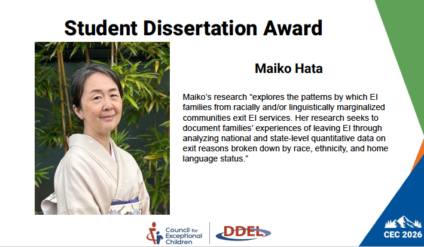

{fig-alt="A slide with a Japanese woman (Maiko) in Kimono with her research description" fig-align="center" width="50%"}

I am genuinely honored and humbled to share that I received the Dissertation Award from the [Council for Exceptional Children (CEC)](https://www.linkedin.com/company/cechq/)'s Division on Diversity and Exceptional Learners.

What made it even more special is having the privilege of listening to Dr. David Connor, one of the foundational scholars behind [DisCrit (Disability Critical Race Theory)](https://www.tcpress.com/products/discritdisability-studies-and-critical-race-theory-in-education_9780807756676#:~:text=DisCrit%E2%80%94Disability%20Studies%20and%20Critical,Education%209780807756676%20%7C%20Teachers%20College%20Press), a framework he developed with Drs. Annamma and Ferri. To be recognized on the same platform where Dr. Connor whose scholarship literally shaped the theoretical foundation of my dissertation, felt surreal.

My dissertation examined early intervention exit patterns nationally and in Oregon, centering race, home languages, and [Social Determinants of Health](https://odphp.health.gov/healthypeople/priority-areas/social-determinants-health) through a [QuantCrit](https://www.tandfonline.com/doi/full/10.1080/13613324.2017.1377417) and intersectionality lens. This work is about the children and families whose stories live inside the data, and about building a more equitable path forward.

Thank you to CEC DDEL for this recognition!! 🙏🏼

Please don’t hesitate to reach out via [LinkedIn page](https://www.linkedin.com/in/maikohata/) or [Email](mailto:maikohatadelaney@gmail.com), I would love to hear from you! For an updated CV, please [click here](https://maihata.github.io/finalproj/images/Maiko_CV_26.pdf).
