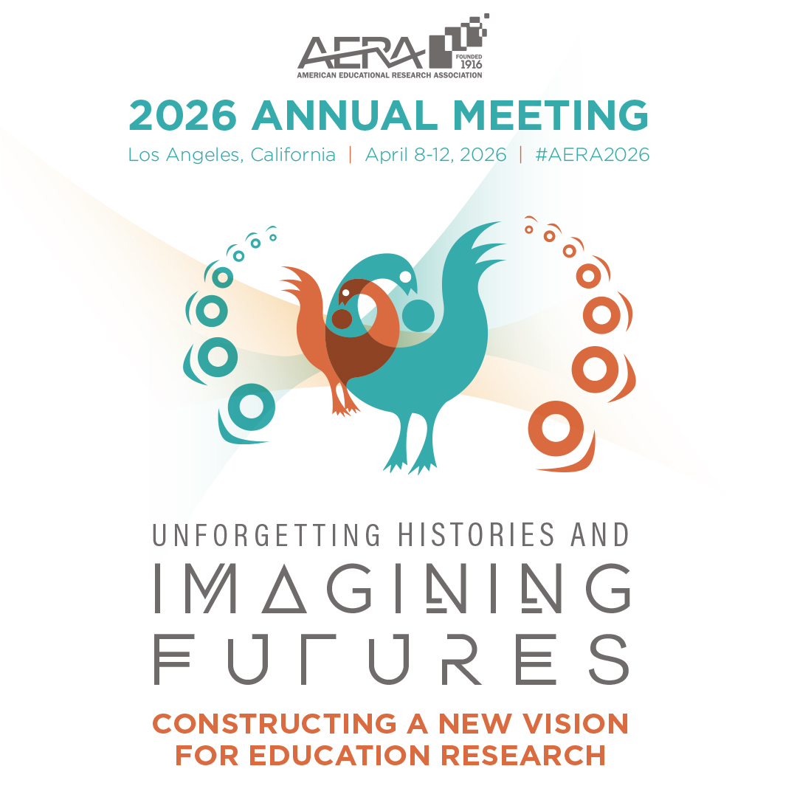

{fig-alt="AERA 2026 annual meeting image with birds" fig-align="center" width="60%"}

Excited to share that I'm presenting at the 2026 American Educational Research Association (AERA) Annual Meeting in Los Angeles. This work sits at the intersection of early intervention equity, language, and the often-invisible structures that shape who gets support and who doesn't.

My presentation, **How Home Language(s) Shape Early Intervention Exit: Unpacking Equitable Access",** is on Friday, 4/10, 9:45 at JW Marriott L.A. Live, Ground floor, Gold 2.

Here's the abstract:

This study investigates equitable access to Early Intervention (EI) by examining how children's home language(s) and broader social contexts shape patterns of service exit. It also critiques a data system shaped by long-standing, unquestioned practices that fail to capture accurate demographic data, limiting understanding of who receives, and who loses, support. Using state-level data, the study explores disparities in EI exit reasons through QuantCrit, DisCrit, and Intersectionality frameworks. Infants and toddlers from English-only households were more likely to exit as "Not Eligible," a pattern that may reflect differences in referral pathways or initial concerns. To support more accurate and equity-minded data practices across early childhood education systems, this study proposes a new data guideline: GUIDE-EI.

If you'll be at AERA, please consider joining the session Friday morning! And if you can't make it in person, [the handout is available here](AERA26_1p_handout.pdf). I would love to connect via [LinkedIn page](https://www.linkedin.com/in/maikohata/) or [Email](mailto:maikohatadelaney@gmail.com) as well!
