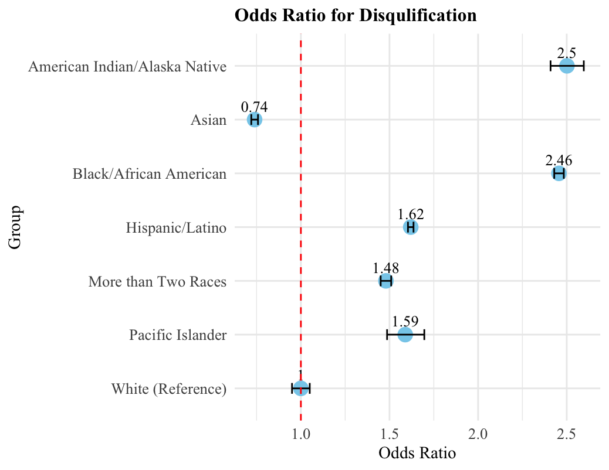

```{r setup, include=FALSE}
knitr::opts_chunk$set(echo = TRUE)
```

## Data Visualization for Equitable EI Access

In this data visualization and storytelling portfolio, I conducted a secondary data analysis of extant data. These data were published by the [Office of Special Education Programs (OSEP)](https://data.ed.gov/dataset/idea-section-618-data-products-static-tables-part-c) and [Oregon Department of Education (ODE)](https://www.oregon.gov/ode/reports-and-data/SpEdReports/Pages/default.aspx). OSEP collects annual data on children, aged 0 to 2, who have stopped receiving [Early Intervention (EI)](https://www.cdc.gov/ncbddd/actearly/parents/states.html) services, with information categorized by gender, race, and ethnicity.

{width="350"}

------------------------------------------------------------------------

## Datasets

Between 2013 and 2021, 3,310,559 infants and toddlers with disabilities and/or developmental delays received and exited Early Intervention (EI) services nationwide (U.S. Department of Education [DOE], 2025). In Oregon, 29,945 infants and toddlers received EI services during that time (DOE, 2025). In the following sections, I'll explore the data for all children who were eligible for EI services and stopped receiving them between 2013 and 2022, using visualizations and storytelling to highlight key insights.

------------------------------------------------------------------------

## Let's dive in!

{width="400"}
